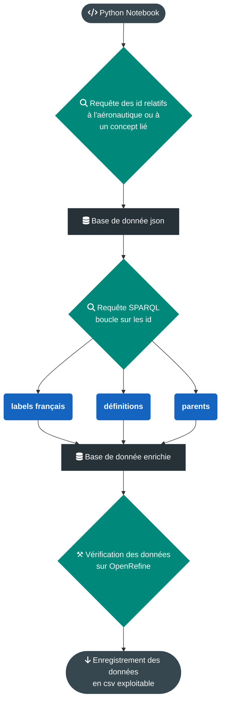

# Outil de récupération des données relatives à l'aéronautique sur Wikidata

## Données attendues

- ID Wikidata
- Termes (fr,en)
- Termes parents
- Définition (fr, sinon en)

En format JSON, CSV, SKOS

## Type de données relatives à l'aéronautique

- Industrie et économie :
    - Constructeurs
    - Modèles d'avions
    - Métiers de l'aéronautique et vocabulaire métier
    - Equipement 
    - Matériaux utilisés en aéronautique (?)
- Histoire :
    - Evénements de l'histoire de l'aviation
    - Personnalités liées à l'aviation
- Science :
    - Concepts liés à l'aéronautique
- Evénements :
    - Salons, congrès, ...

## Méthode

